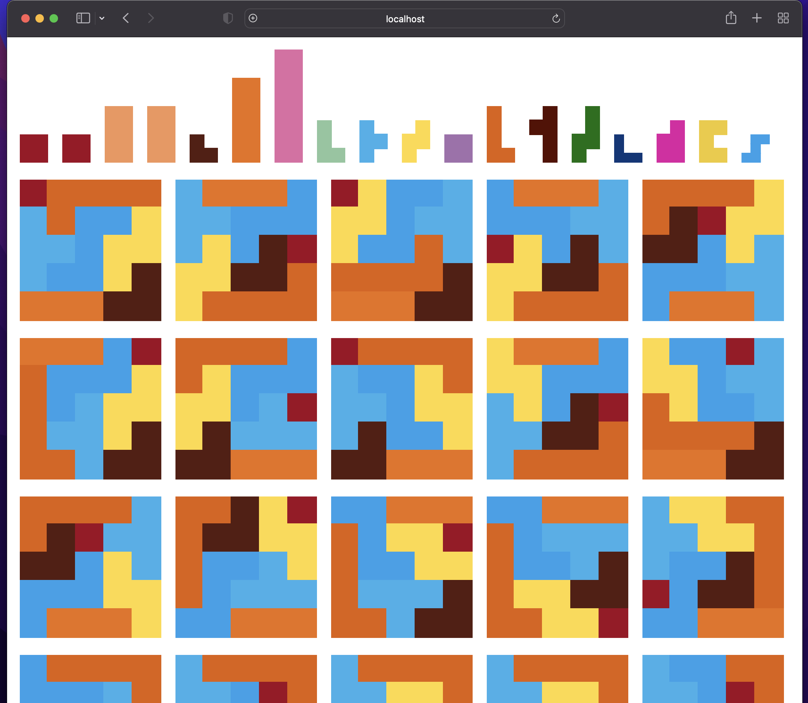

# Gagne Ton Papa! WASM Bindings

This crate provides WebAssembly bindings for the core `gtp-lib` library, allowing it to be used in web applications. It uses `wasm-bindgen` to facilitate communication between Rust and JavaScript.

## Build

To build the WASM package for use in the web app, run:

```bash
wasm-pack build --target web
```

This will generate a `pkg` directory containing the compiled WASM binary and JavaScript glue code.

## Testing

You can test the WASM module locally using a simple HTTP server:

```bash
python3 -m http.server
open http://localhost:8000
```

This serves the `index.html` file in this directory, which imports the WASM module.


